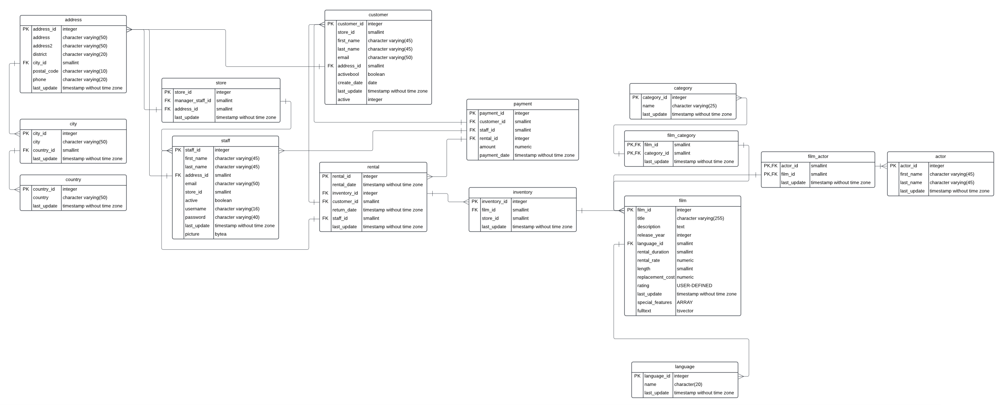

# cf_rockbuster
A movie rental business hopes to break out of the dark ages into the movie streaming business. Board members at a fictional company (Rockbuster Steath) hope a data analyst can sift through their data tables to decipher what the top performing, movie genres, and highest paying customers are. Once all of this insightful data is gleaned, what will their first foray into digitization be??

## Objective
The Rockbuster Stealth Management Board has asked a series of business questions and
they expect data-driven answers that they can use for their 2020 company strategy. Here are
the main questions they’d like to answer:

- Which movies contributed the most/least to revenue gain?
- What was the average rental duration for all videos?
- Which countries are Rockbuster customers based in?
- Where are customers with a high lifetime value based?
- Do sales figures vary between geographic regions?

## Data

The fictional "Rockbuster" dataset can be found [here](http://www.postgresqltutorial.com/wp-content/uploads/2019/05/dvdrental.zip)

File should be a zip of dvdrental.tar

The following is a snapshot of the entity relationship diagram highlighting all of the tables involved in the relational database queries.

## Tools

The PostgreSQL database was utilized for running the assignment queries. 

Database [links](https://www.enterprisedb.com/downloads/postgres-postgresql-downloads)

## SQL Queries

Rockbuster Steath CTE files are located in folder **Rockbuster Stealth Video Rental Analysis/02 Query Data/**

## Resources

Link to an interactive Tableau map of data presented within the Rockbuster [project](https://public.tableau.com/app/profile/kirsten.currie/viz/RockbusterCustomerPaymentTotalsbyCountry/CustomerPayments?publish=yes)
